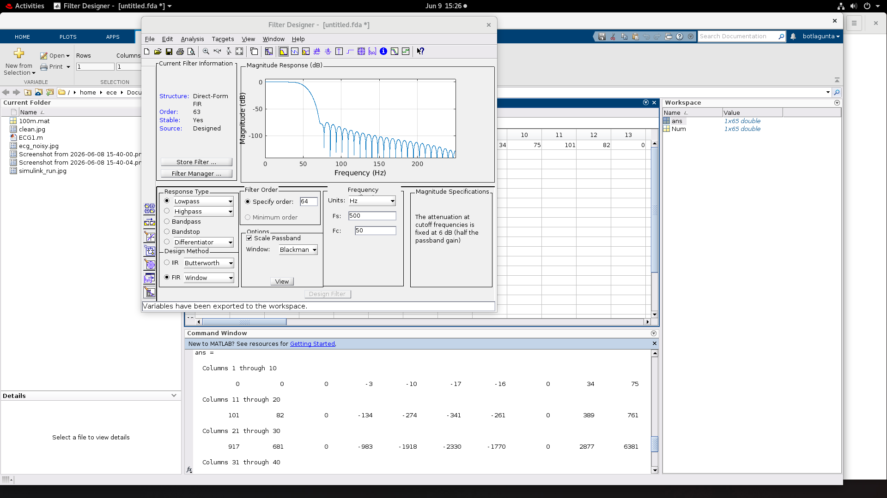

# 64th-Order FIR Filter for ECG Denoising

This repository contains the RTL design, MATLAB/Simulink reference work, synthesis reports, and physical-design outputs for a **64th-order FIR filter** intended for ECG signal noise reduction.

The digital filter is implemented in Verilog using a symmetric FIR structure and a Wallace Tree Multiplier based datapath. The project flow covers signal preparation, RTL simulation, logic synthesis, and physical-design stages.

## Highlights

- 64th-order FIR filter architecture for ECG denoising
- 16-bit input samples and 32-bit filter output
- Wallace Tree Multiplier implementation for FIR coefficient multiplication
- MATLAB script for clean/noisy ECG signal generation
- Synopsys Design Compiler synthesis outputs
- IC Compiler II physical-design scripts and screenshots
- Area, timing, and power reports included

## Repository Structure

```text
.
|-- rtl/                 # Verilog RTL and testbench
|-- simulink/            # MATLAB script, ECG data, and Simulink/result images
|-- synthesis/           # Design Compiler scripts, reports, constraints, netlists, schematics
|-- physical_design/     # ICC2 TCL scripts and layout screenshots
|-- docs/                # Repository documentation and asset index
|-- JRNL3_Fin_rev_old.pdf
|-- filter_designer.png
`-- README.md
```

## Design Flow

This repository is intended to preserve the project files and results. The MATLAB, Simulink, Synopsys Design Compiler, and IC Compiler II runs were completed on a lab computer with the required licensed tools. A normal personal computer can still view the code, screenshots, reports, and documentation without installing those premium tools.

1. **Signal preparation**
   - ECG data is loaded from `simulink/100m.mat`.
   - `simulink/ECG1.m` generates clean and noisy ECG waveforms.

2. **RTL design**
   - `rtl/filter_64.v` contains the complete FIR datapath, adders, flip-flops, and multiplier modules.
   - `rtl/tb.v` provides a simple simulation testbench.

3. **Synthesis**
   - `synthesis/dc_script.tcl` runs Design Compiler synthesis.
   - Timing, area, and power reports are stored in `synthesis/`.

4. **Physical design**
   - `physical_design/*.tcl` scripts cover floorplanning, placement, power planning, clock tree synthesis, and routing.
   - Layout screenshots are included for each major implementation stage.

## Key Results

| Metric | Value |
| --- | ---: |
| Technology library | SAED 32 nm RVT |
| Clock period constraint | 20 ns |
| Total cell area | 14,552.539644 |
| Total area | 17,531.567457 |
| Dynamic power | 160.5735 uW |
| Leakage power | 25.7415 uW |
| Total reported power | 186.3152 uW |
| Sequential cells | 320 |
| Combinational cells | 4,980 |

Source reports:

- [`synthesis/filter_64_area.rpt`](synthesis/filter_64_area.rpt)
- [`synthesis/filter_64_power.rpt`](synthesis/filter_64_power.rpt)
- [`synthesis/filter_64_timing.rpt`](synthesis/filter_64_timing.rpt)

## Preview

### Filter Design



### ECG Signals

| Clean ECG | Noisy ECG |
| --- | --- |
|  |  |

### Physical Design

| Floorplan | Placement |
| --- | --- |
|  |  |

| Power Plan | Routing |
| --- | --- |
|  |  |

## Running the RTL Simulation

From the repository root:

```sh
cd rtl
iverilog -o filter_64_tb filter_64.v tb.v
vvp filter_64_tb
```

The default simulation writes `filter_64_tb.vcd`. To use FSDB dumping with a simulator that supports it, compile with the `FSDB` macro enabled.

## Running the MATLAB Script

Open MATLAB in the `simulink/` directory and run:

```matlab
ECG1
```

The script loads `100m.mat`, creates a noisy ECG signal at the configured SNR, and plots clean/noisy ECG waveforms.

## Synthesis Notes

The synthesis flow expects the local Synopsys/SAED setup referenced by the TCL scripts. These licensed tools are not required to browse the repository, but they are required to rerun synthesis. Paths such as `./../ref`, `./rm_setup/dc_setup.tcl`, and `./../CONSTRAINTS/filter_64.sdc` may need to be adjusted for a different lab machine.

Main files:

- [`synthesis/dc_script.tcl`](synthesis/dc_script.tcl)
- [`synthesis/filter_64.sdc`](synthesis/filter_64.sdc)
- [`synthesis/filter_64.mapped.v`](synthesis/filter_64.mapped.v)

## Physical Design Notes

The physical-design scripts were prepared for Synopsys IC Compiler II with SAED 32 nm reference libraries. These files document the completed lab flow and require the same licensed environment to rerun. They include:

- [`physical_design/floorplan.tcl`](physical_design/floorplan.tcl)
- [`physical_design/placement.tcl`](physical_design/placement.tcl)
- [`physical_design/power_planning.tcl`](physical_design/power_planning.tcl)
- [`physical_design/clock.tcl`](physical_design/clock.tcl)
- [`physical_design/route.tcl`](physical_design/route.tcl)

## Documentation

Additional screenshots, schematics, and PDFs are indexed in [`docs/ASSET_INDEX.md`](docs/ASSET_INDEX.md).

For publishing steps, see [`docs/GITHUB_UPLOAD_GUIDE.md`](docs/GITHUB_UPLOAD_GUIDE.md).

## License

No license has been specified yet. Add a license before publishing if others should be allowed to reuse, modify, or distribute this work.
