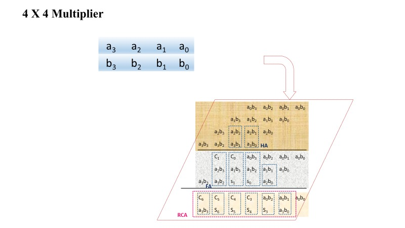
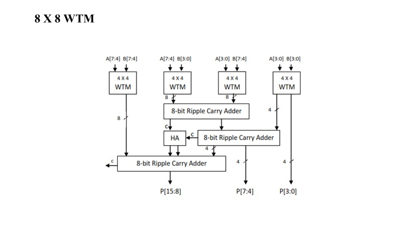
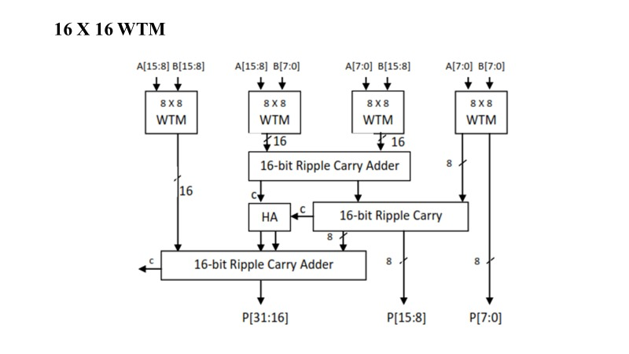

# HVWTM and FIR Architecture

This folder contains the architecture diagrams used to explain the hierarchical Hybrid Vedic-Wallace Tree Multiplier and its use in the ECG FIR filter.

## Hybridization Strategy

The HVWTM combines:

- **Vedic decomposition at the top level:** each N-bit operand is divided into upper and lower N/2-bit halves.
- **Wallace Tree multiplication at the lower level:** the four half-width products are generated using WTM blocks.
- **Parallel addition:** ripple-carry adders and a half-adder combine the vertical and crosswise partial products.

This structure targets the modular, shorter-interconnect behavior of Vedic multiplication while retaining the compact partial-product reduction of Wallace Tree multiplication.

## Hierarchy

### 4x4 Wallace Tree Multiplier

### 8x8 Hierarchical Multiplier

### 16x16 HVWTM

The signed 16x16 block is instantiated for each non-zero FIR coefficient product.

## 64th-Order Symmetric FIR

Coefficient symmetry allows sample pairs such as `x[n] + x[n-64]` to share a multiplier. The implementation therefore uses 32 paired products and one center-tap product instead of 65 independent multipliers.
