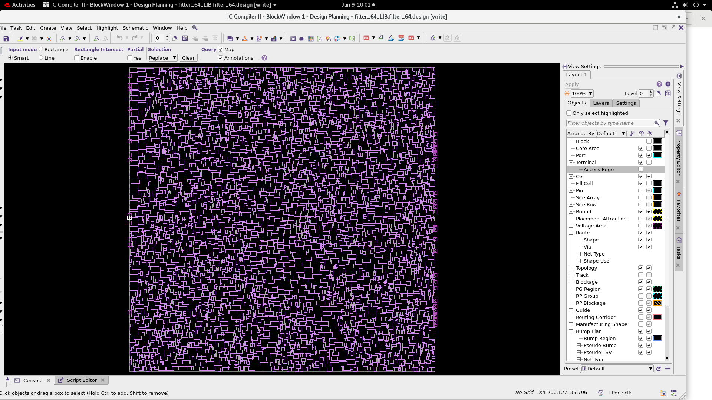
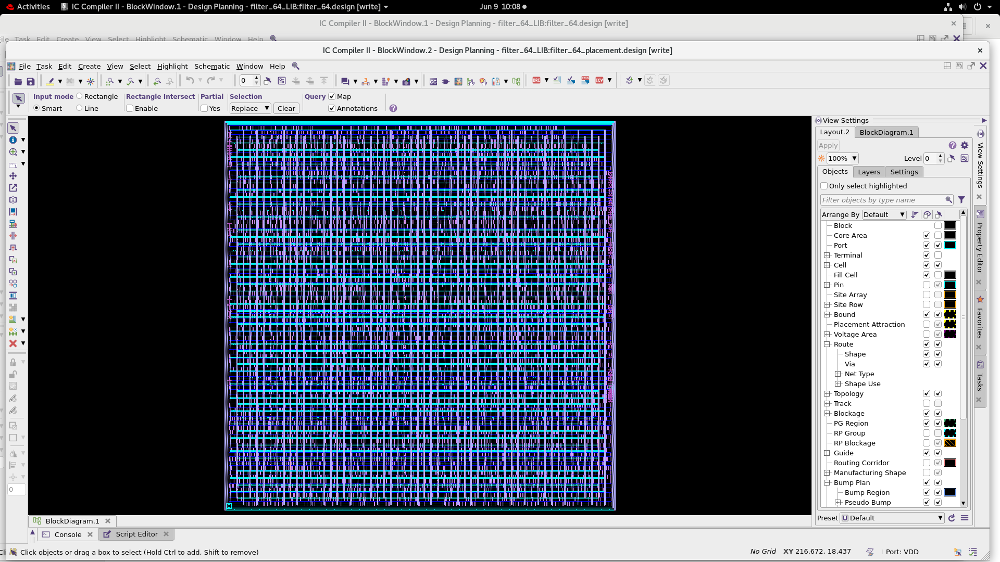
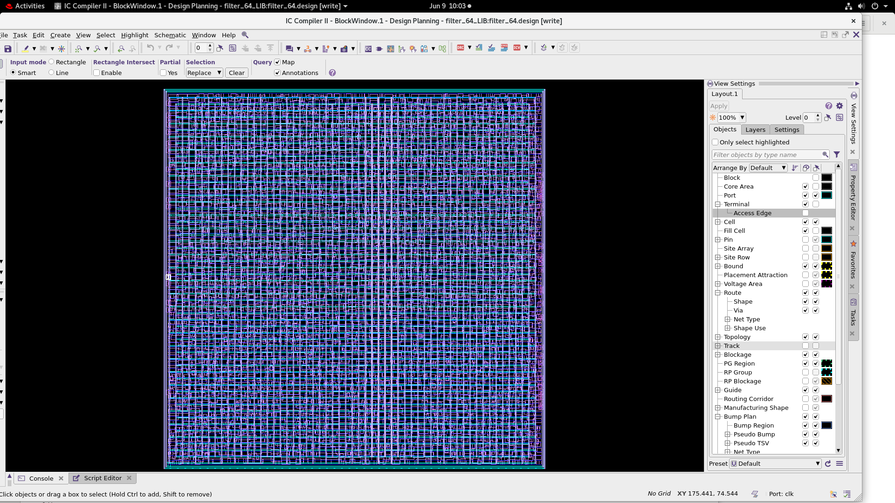
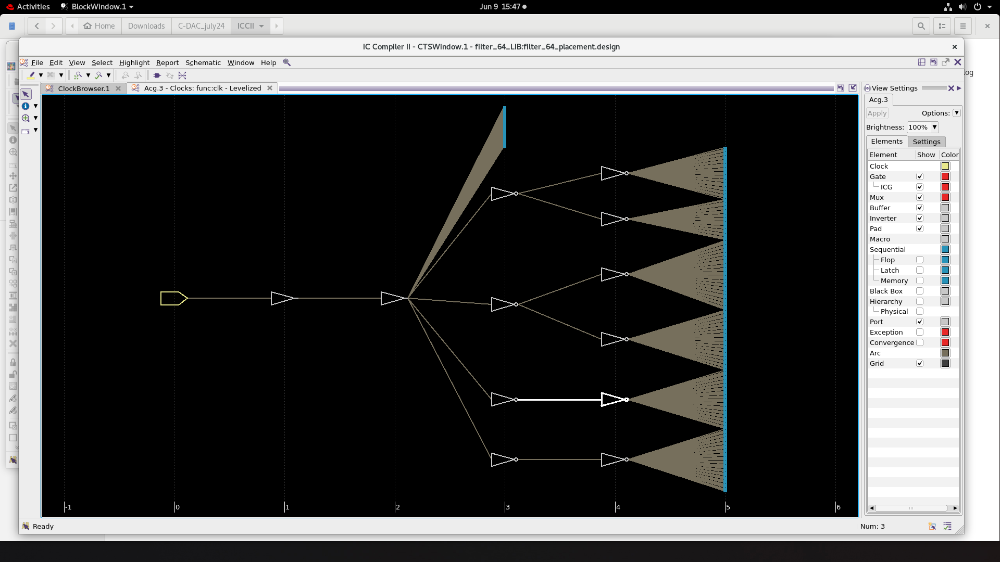
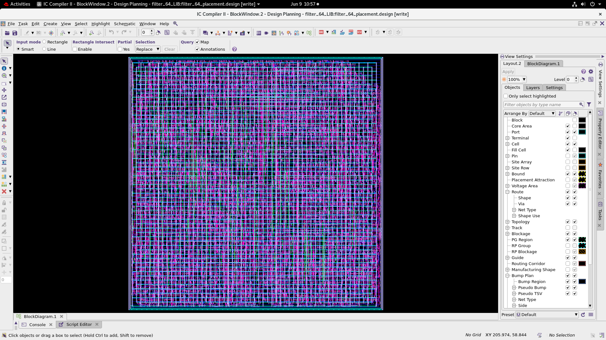
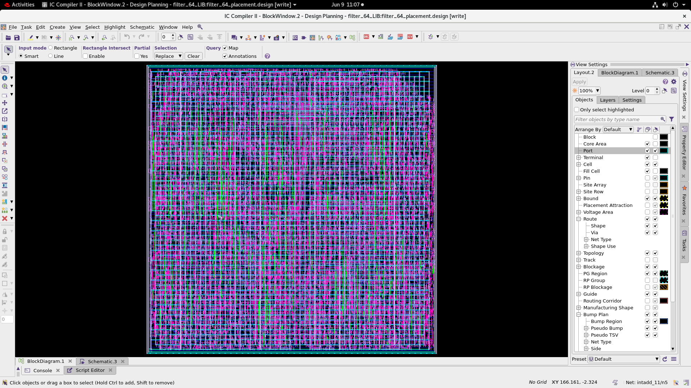
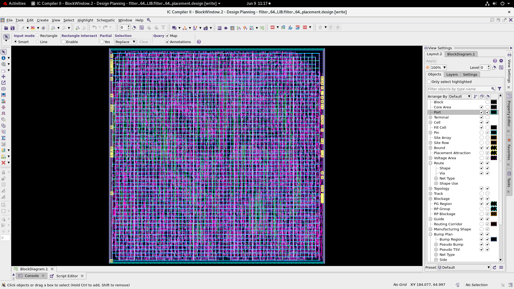
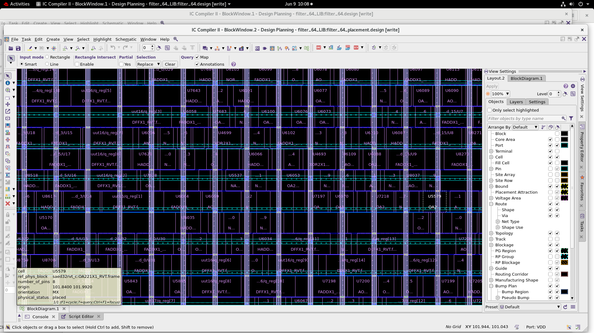

# Synopsys ICC2 Physical Design

This folder documents the physical implementation of the synthesized `filter_64` netlist using Synopsys IC Compiler II and SAED 32 nm reference libraries.

## Flow

| Stage | Script | Evidence |
| --- | --- | --- |
| Floorplan and pin placement | [`floorplan.tcl`](floorplan.tcl) | [`floorplan.png`](floorplan.png) |
| Power delivery network | [`power_planning.tcl`](power_planning.tcl) | [`powerplan.png`](powerplan.png) |
| Placement and legalization | [`placement.tcl`](placement.tcl) | [`placement.png`](placement.png) |
| Clock-tree synthesis | [`clock.tcl`](clock.tcl) | [`cts.png`](cts.png) |
| Global/track/detail routing | [`route.tcl`](route.tcl) | [`route.png`](route.png) |

## Floorplan

The input bus and clock are constrained to one side of the core, while the output bus is placed on the opposite side.

## Placement and Power Planning

| Placement | Power rings, mesh, and rails |
| --- | --- |
|  |  |

## Clock Tree

The CTS flow uses `synthesize_clock_tree` and `clock_opt` with local-skew and concurrent clock/data optimization options.

## Routing

The routing script performs timing-driven global routing, track assignment, detail routing, antenna repair, and route optimization. It writes the routed Verilog, SDC, and SPEF outputs.

| Detailed routed view | Layout zoom |
| --- | --- |
|  |  |

## Lab Dependency

The scripts depend on the original SAED NDM and TLU+ files under `PDK_PATH`. These licensed PDK files are intentionally not included.
