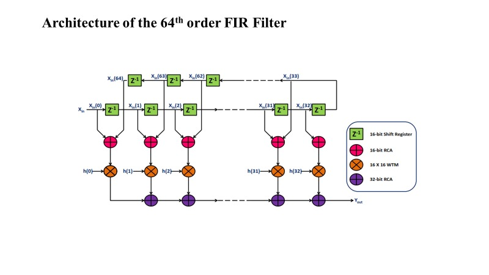
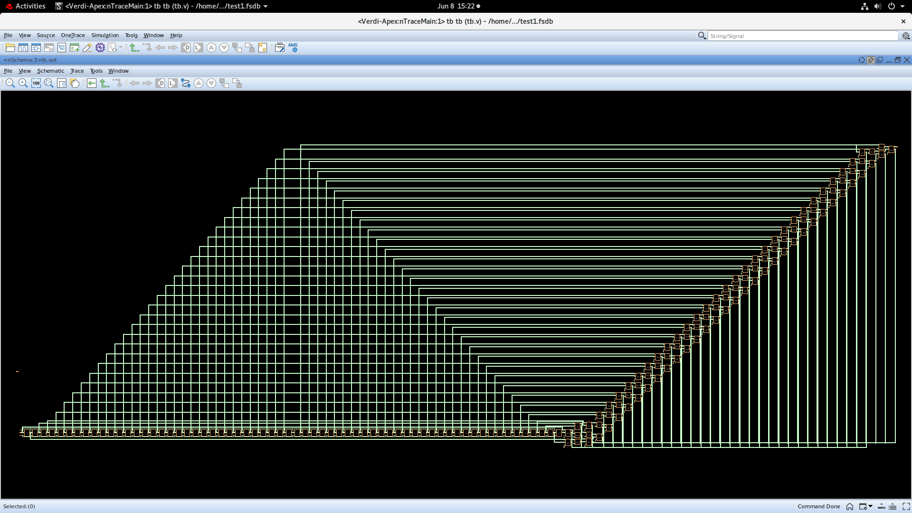
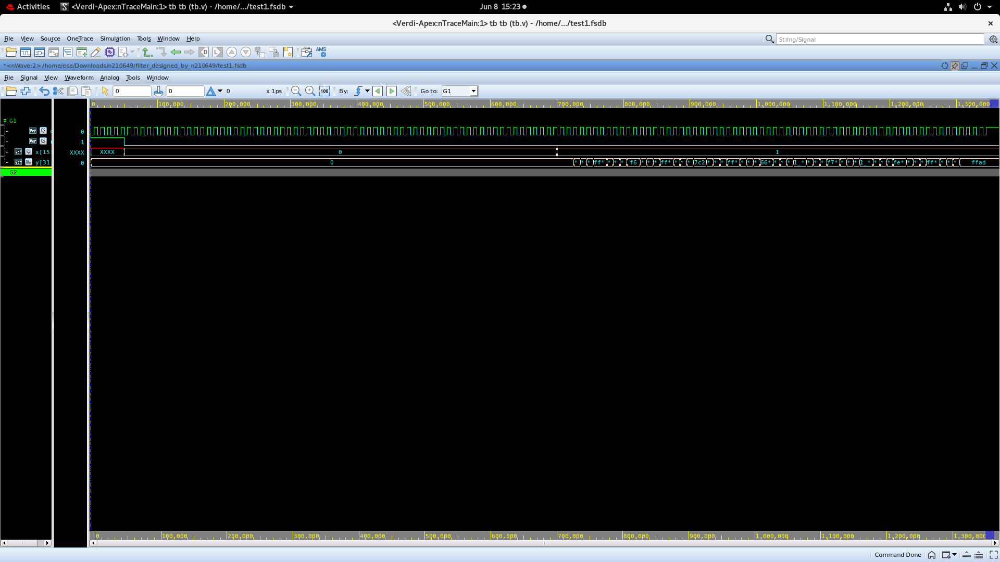

# RTL Design and VCS/Verdi Verification

This folder contains the Verilog implementation of the 64th-order symmetric FIR filter, the hierarchical HVWTM datapath, and the testbench used with Synopsys VCS.

## RTL Hierarchy

`filter_64.v` contains:

- `d_ff`: 16-bit delay element used by the FIR shift register
- `ha` and `fa`: half-adder and full-adder primitives
- `rca_4`, `rca_8`, `rca_16`, `rca_32`: ripple-carry adders
- `mul4x4`: 4x4 Wallace Tree multiplier
- `wtm8x8`: hierarchical 8x8 multiplier
- `wtm16x16`: signed hierarchical 16x16 HVWTM
- `filter_64`: symmetric 64th-order FIR top module

The FIR pairs symmetric samples, multiplies the sums by fixed coefficients, and accumulates the 33 products into the 32-bit output.



## Files

| File | Purpose |
| --- | --- |
| [`filter_64.v`](filter_64.v) | Complete arithmetic hierarchy and FIR top module |
| [`tb.v`](tb.v) | VCS testbench; produces `test.fsdb` |
| [`schematic.pdf`](schematic.pdf) | Exported RTL/Verdi schematic |
| [`tb_dut.png`](tb_dut.png) | Elaborated DUT hierarchy in Verdi |
| [`tb_waveform.png`](tb_waveform.png) | Verification waveform in Verdi |

## Synopsys Commands

Run from the lab environment:

```csh
csh
source /home/synopsys/tools/synopsys_c2s.cshrc
cd rtl
vcs -full64 -debug_access+all -kdb tb.v
./simv
verdi -ssf test.fsdb
```

`tb.v` includes `filter_64.v`, so the VCS command only needs the testbench filename.

## Verification Evidence

| Elaborated DUT | Output waveform |
| --- | --- |
|  |  |

The waveform shows reset, input `x`, clock, and the signed 32-bit FIR output `y`.
