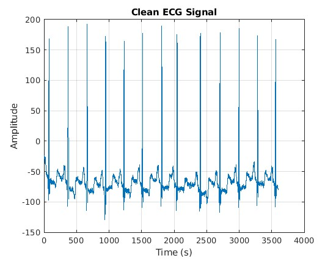
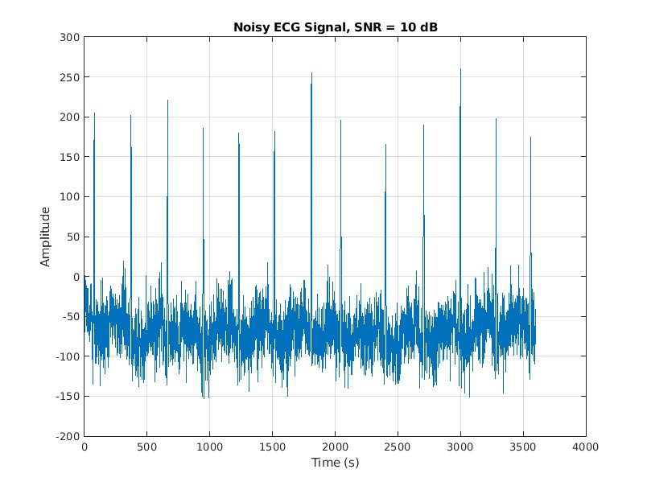
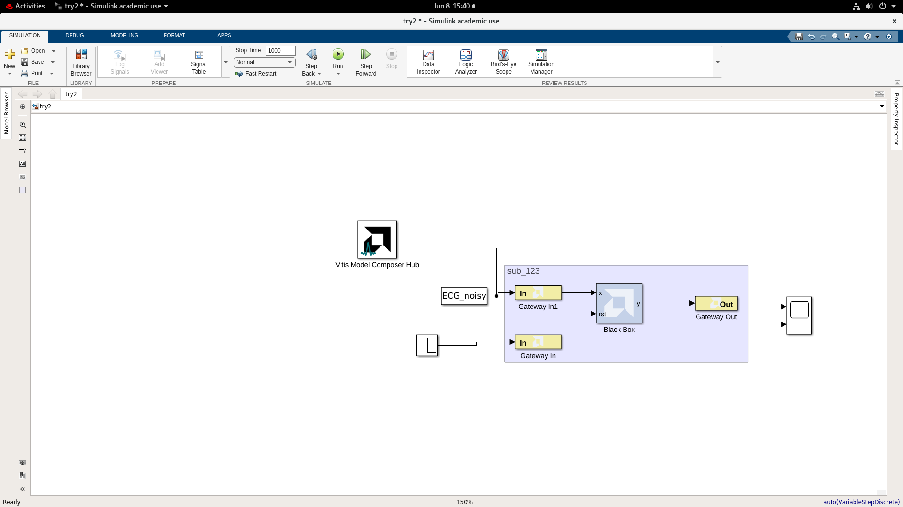
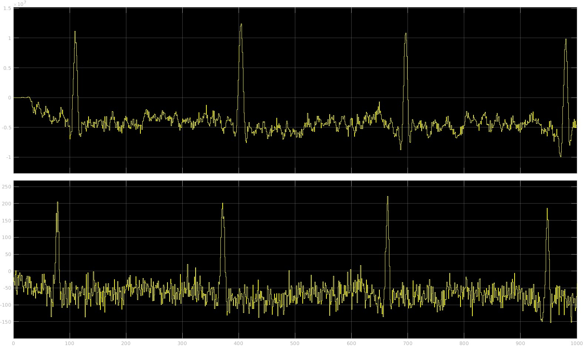

# MATLAB and Simulink Validation

This folder contains the ECG dataset, MATLAB preprocessing script, Simulink black-box circuit, and waveform evidence used to validate the FIR design at system level.

## Signal Preparation

[`ECG1.m`](ECG1.m) performs the following steps:

1. Loads the MIT-BIH `100m` ECG record from `100m.mat`.
2. Treats the record as a 360 Hz sampled ECG signal.
3. Adds Gaussian noise at a configured SNR of 10 dB.
4. Creates clean and noisy ECG vectors for Simulink.
5. Plots the clean and noisy signals.

| Clean ECG | Noisy ECG |
| --- | --- |
|  |  |

## Simulink Circuit

The noisy ECG vector enters the hardware subsystem through a Gateway In block. The Verilog FIR filter is represented by the black box, with reset supplied through a second Gateway In block. The filtered output is returned through Gateway Out and displayed with the input waveform.

## Result

The upper and lower traces show the ECG-related input/output signals observed during the Simulink run.

## Files

| File | Purpose |
| --- | --- |
| `100m.mat` | MIT-BIH ECG record |
| `ECG1.m` | Noise generation and signal preparation |
| `simulink_ckt.png` | Simulink/Vitis Model Composer circuit |
| `simulink_run.jpg` | Simulation waveform |
| `clean.jpg` | Clean ECG plot |
| `ecg_noisy.jpg` | Noisy ECG plot |
