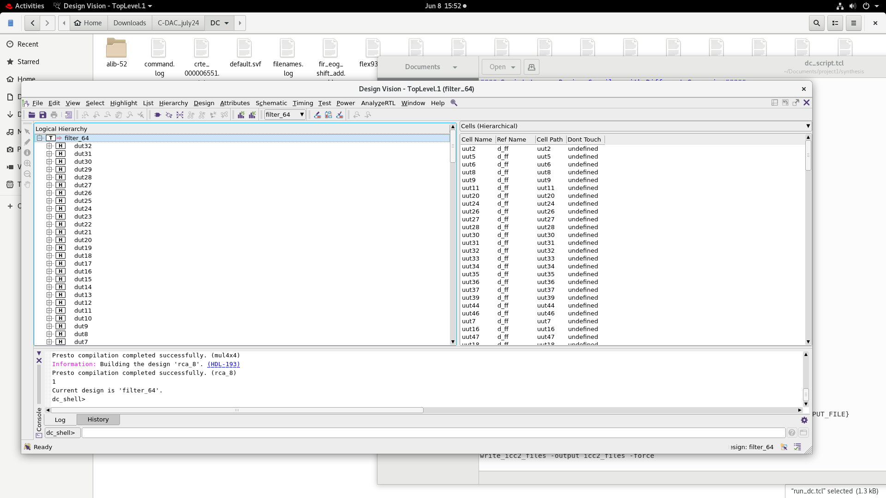
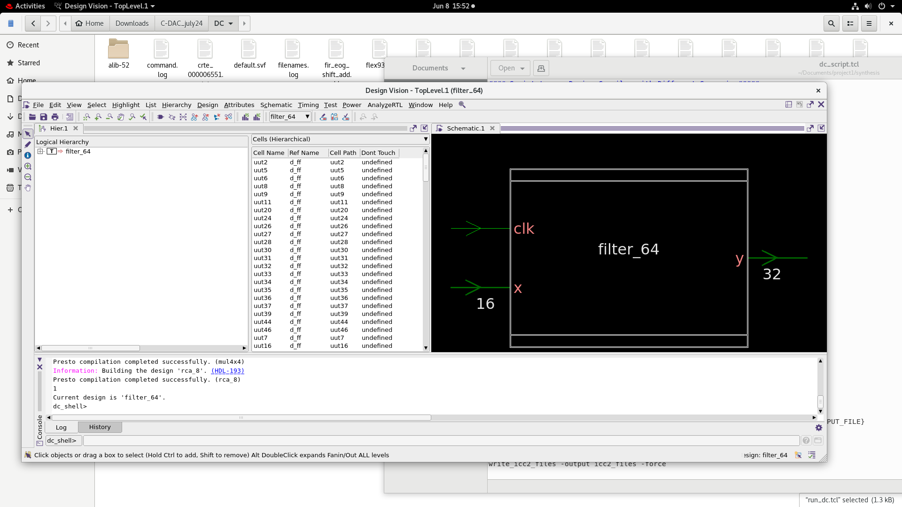
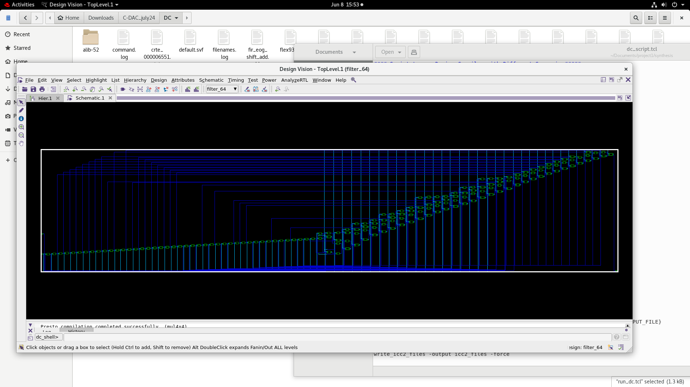
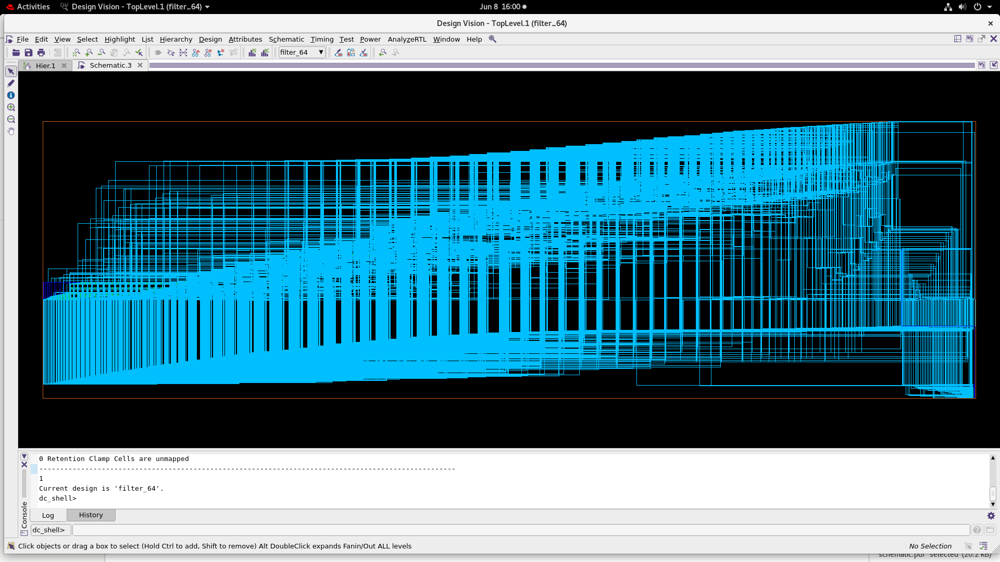

# Synopsys Design Compiler Synthesis

This folder preserves the Design Compiler synthesis flow, constraints, mapped outputs, reports, and schematic evidence for the HVWTM-based 64th-order FIR filter.

## Flow

[`dc_script.tcl`](dc_script.tcl) performs:

1. SAED library and Design Compiler setup
2. Analysis and elaboration of `../rtl/filter_64.v`
3. Application of the SDC constraints
4. `compile_ultra`
5. Area, timing, and power report generation
6. Mapped Verilog/SDC and ICC2 handoff generation

| Elaborated design | Top-level module | Pre-compile schematic |
| --- | --- | --- |
|  |  |  |

The optimized hierarchy after `compile_ultra` is shown below.

## Constraints

The source [`filter_64.sdc`](filter_64.sdc) defines:

- Clock period: `20 ns`
- Maximum input delay: `0.5 ns`
- Maximum output delay: `0.5 ns`
- Setup uncertainty: `0.3 ns`
- Hold uncertainty: `0.1 ns`
- Maximum design transition: `0.25 ns`
- Maximum clock-path transition: `0.15 ns`

## Results

| Metric | Result |
| --- | ---: |
| Critical-path arrival time | 15.44 ns |
| Required time | 19.20 ns |
| Setup slack | +3.76 ns, MET |
| Total cell area | 14,552.539644 |
| Estimated net interconnect area | 2,979.027813 |
| Total area | 17,531.567457 |
| Dynamic power | 160.5735 uW |
| Leakage power | 25.7415 uW |
| Total reported power | 186.3152 uW |
| Total cells | 5,314 |
| Combinational cells | 4,980 |
| Sequential cells | 320 |

## Outputs

| File | Purpose |
| --- | --- |
| `filter_64.mapped.v` | SAED 32 nm mapped gate-level netlist |
| `filter_64.mapped.sdc` | Constraints written after mapping |
| `filter_64_area.rpt` | Hierarchical area report |
| `filter_64_power.rpt` | Internal, switching, and leakage power |
| `filter_64_timing.rpt` | Maximum-delay timing path |
| `schematic.pdf` | Elaborated schematic export |
| `schematic_compile.pdf` | Compile schematic export |
| `schematic_ultra.pdf` | Compile Ultra schematic export |

## Lab Dependency

The script references the original lab setup, including `rm_setup/dc_setup.tcl`, `RESULTS_DIR`, and the SAED reference library. Those licensed files are not distributed in this repository.
