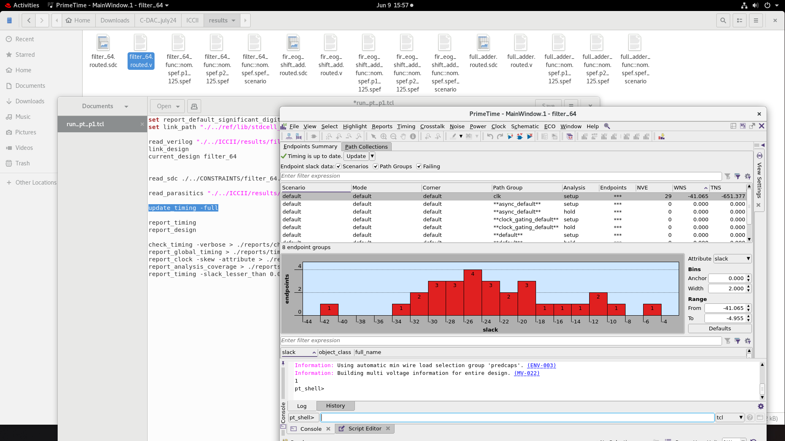
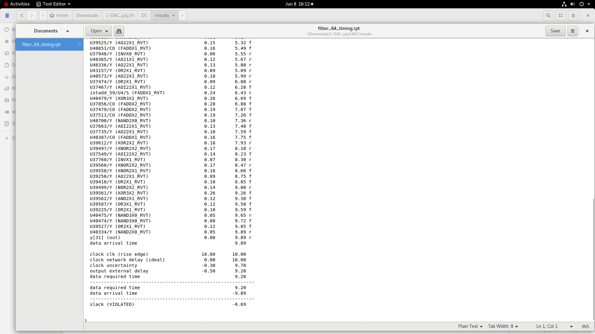
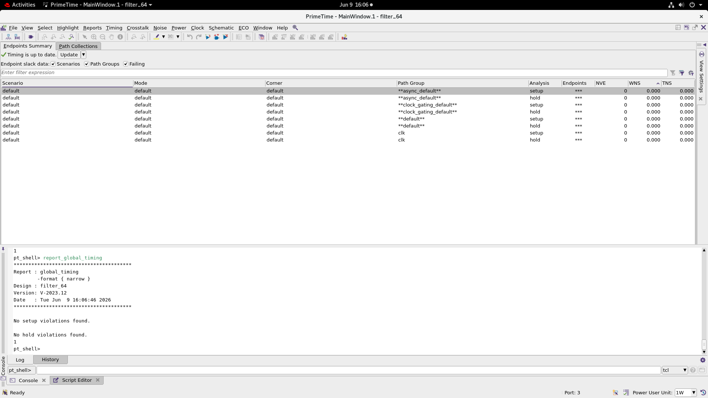

# Synopsys PrimeTime Timing Analysis

This folder records PrimeTime experiments performed on the routed FIR design using the routed netlist, SDC constraints, and extracted parasitics.

## Analysis Flow

The screenshot-visible PrimeTime script performs the core steps:

```tcl
read_verilog <routed-netlist>
link_design
current_design filter_64
read_sdc <constraints>
read_parasitics <routed-spef>
update_timing -full
report_timing
report_global_timing
report_clock -skew
```

## Constraint Experiments

### Aggressive 1 ns Constraint



Observed setup summary:

| Metric | Value |
| --- | ---: |
| Violating endpoints | 29 |
| WNS | -41.065 ns |
| TNS | -651.377 ns |
| Hold violations | None shown |

This constraint is far below the routed critical-path capability and produces substantial setup violations.

### Intermediate Violating Run



The image was originally supplied as a 50 ns experiment, but the visible path report shows:

| Metric | Value |
| --- | ---: |
| Clock rise edge | 10.00 ns |
| Data arrival time | 9.89 ns |
| Data required time | 9.20 ns |
| Setup slack | -0.69 ns, VIOLATED |

The repository names and describes this artifact according to the values visible in the report.

### Relaxed 100 ns Constraint



PrimeTime reports:

- No setup violations found
- No hold violations found

## Synthesis Timing Reference

The Design Compiler run uses a 20 ns clock and reports a 15.44 ns arrival time with `+3.76 ns` setup slack. See [`../synthesis/filter_64_timing.rpt`](../synthesis/filter_64_timing.rpt).
